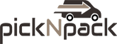

<!DOCTYPE html>
<html lang="en">
<head>
    <meta charset="UTF-8">
    <meta name="viewport" content="width=device-width, initial-scale=1.0">
    <title>NivoTechnologies | Engineering Digital Excellence</title>
    <link rel="stylesheet" href="style.css">
    <link href="https://fonts.googleapis.com/css2?family=Inter:wght@300;400;600&display=swap" rel="stylesheet">
</head>
<body>

    <nav>
        

            
NIVOTECHNOLOGIES

            <ul class="nav-links">
                <li><a href="#projects">Projects</a></li>
                <li><a href="#services">Services</a></li>
                <li><a href="#contact">Contact</a></li>
            </ul>
        

    </nav>

    <header class="hero">
        

            
Future-Ready Software Engineering

            <h1>Engineering Digital  Excellence.</h1>
            
Specializing in high-performance E-commerce, Healthcare SaaS, and Industrial Marine Systems.

            

                <a href="#projects" class="btn primary">View Projects</a>
                <a href="#contact" class="btn secondary">Get in Touch</a>
            

        

    </header>

    <section class="clients">
    

        
Trusted By

        

            
            

                
                Marine Electricals
            

            

    

</section>

<section id="projects" class="projects">
    

        <h2 class="section-title">Current Ventures</h2>
        

            

                

                    
                    Live Development
                

                <h3>PickNPack.in</h3>
                
Building a robust E-commerce ecosystem for industrial packaging solutions.

            

            
            

                

                    
                
                Industrial Systems
                

                <h3>Marine Logic Systems</h3>
                
Engineering specialized software logic and electrical infrastructure integrations for Mumbai-based Marine Electricals.

            

            
            

                

                     
DP

                     SaaS Beta
                

                <h3>DentistryPro</h3>
                
A clinician-facing platform for intuitive dental charting, patient record management, and automated medical reporting.

            

        

    

</section>

    <footer id="contact">
        

            <h2>Let's build the future.</h2>
            
Based in Washim | Serving Clients Globally

            <a href="mailto:contact@nivotechnologies.com" class="email-link">contact@nivotechnologies.com</a>
            

                
&copy; 2026 NivoTechnologies. All rights reserved.

            

        

    </footer>

</body>
</html>
